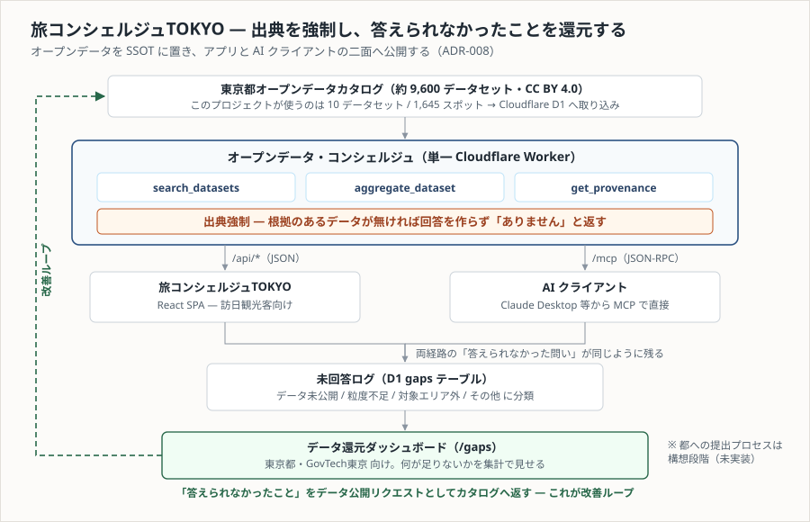
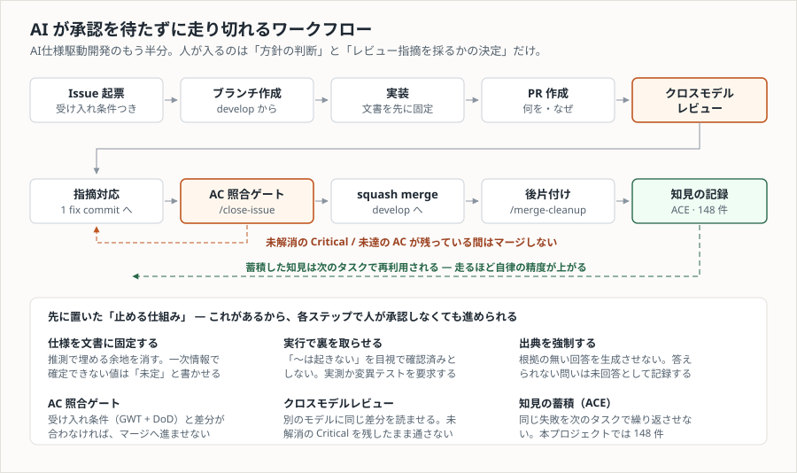

# 🗼 旅コンシェルジュTOKYO (Tabi Concierge Tokyo)

> 9,600のオープンデータを、旅の相棒に。

東京都知事杯オープンデータ・ハッカソン 2026 参加プロジェクト（チームshiwata）

**本番（Cloudflare Workers）**: <https://tabi-concierge-tokyo.tokyo-odh-091.workers.dev> — 管理画面（データ還元ダッシュボード）は <https://tabi-concierge-tokyo.tokyo-odh-091.workers.dev/gaps>

> ⚠️ **この公開URLは停止予定です。** デプロイ先の Cloudflare アカウント（`tokyo_odh_091`）は主催者から貸与されたもので、
> ハッカソン終了にともない利用できなくなります（2026-09-19 時点ではまだ 200 を返します）。
> 動く実物の記録として、**操作デモ動画・提出資料・提出キャプチャをこのリポジトリと Releases に残してあります** → [提出物](#提出物ハッカソンに出したものそのもの)。

**ライセンス**: コードと文書は MIT。同梱の東京都オープンデータ（`data/`）は CC BY 4.0、メンバーの肖像は本人提供素材で対象外 → [ライセンス](#ライセンス)

## 概要

訪日観光客向けのAI旅行ガイドアプリ。東京都オープンデータカタログ（約9,600データセット）をバックエンドの「オープンデータ・コンシェルジュ」経由で活用し、出典付きで旅程提案・文化ガイド・周辺案内を提供する。

## アーキテクチャ




コア3操作（`search_datasets` / `aggregate_dataset` / `get_provenance`）を単一の Cloudflare Worker が二面公開する（ADR-008）。**中身はもう固定データのスタブではない** — `aggregate_dataset` は D1 を実照会し（Text-to-SQL・Issue #119）、`search_datasets` は自然文だけの呼び出しを LLM で構造化入力へ分解してから既存のキーワード判定へ渡す（メタデータRAG・Issue #120。候補のマッチ自体は今もキーワード表が行う）。LLM が使えないとき（`aggregate_dataset` は D1 が使えないときも）は、スタブ時代の実装へ縮退する（[API.md](docs/02-design/API.md) §3・§4）。

- 回答には出典（東京都オープンデータカタログのデータセットリンク）を100%強制付与
- CC BY 4.0の出典表示義務を設計レベルで自動達成
- 答えられなかった質問は「データ公開リクエスト」として都へ自動還元

設計の詳細は [ARCHITECTURE.md](docs/02-design/ARCHITECTURE.md)、フロントエンドが呼ぶ `/api/*` の仕様は [API.md](docs/02-design/API.md)、AI クライアント向け `/mcp`（MCP ツール）の仕様は [MCP.md](docs/02-design/MCP.md) を参照（単一 Worker の二面公開・ADR-008）。

## 開発の進め方 — AI仕様駆動開発

本リポジトリは **AI仕様駆動開発（AI Spec-Driven Development / AI-SDD）** を採用している。企画の一次情報（Notion）を `docs/` へ構造化して置き、人間と AI ツールが同じ文書を参照しながら実装を進める。企画内容の SSOT は Notion、実装の参照先は `docs/`。

方法論そのもの（コア7文書のスキーマ・原則）は **[ai-spec-driven-development](https://github.com/feel-flow/ai-spec-driven-development)** に公開されている。
本リポジトリはその適用事例で、実装を助けるツール側が [ff-dev-toolkit](https://github.com/feel-flow/ff-dev-toolkit)（[使ったツール](#使ったツール)を参照）。

### 読み始める場所

**[docs/MASTER.md](docs/MASTER.md) が起点**。プロジェクト識別情報・技術スタック・コード生成ルール・全文書への索引が集約されている。AI ツールはここから必要な文書だけを辿る。

| 目的 | 読む文書 |
| --- | --- |
| 何を作るのか知りたい | [PROJECT.md](docs/01-context/PROJECT.md) — ビジョン・対象ユーザー・5機能・KPI・スコープ |
| 守るべき制約を知りたい | [CONSTRAINTS.md](docs/01-context/CONSTRAINTS.md) — 提出要件・締切・CC BY 4.0・著作権ルール |
| 設計を知りたい | [ARCHITECTURE.md](docs/02-design/ARCHITECTURE.md) / [DOMAIN.md](docs/02-design/DOMAIN.md) / [API.md](docs/02-design/API.md) / [MCP.md](docs/02-design/MCP.md) / [DATABASE.md](docs/02-design/DATABASE.md) |
| なぜそう決めたか知りたい | [DECISIONS.md](docs/06-reference/DECISIONS.md) — 設計判断記録（ADR） |
| 用語を確認したい | [GLOSSARY.md](docs/06-reference/GLOSSARY.md) — A〜Z 節は一般的な技術用語の辞書。本プロジェクト固有の用語は末尾の節 |
| 何を作業するか知りたい | [TASKS.md](docs/07-project-management/TASKS.md) / [ROADMAP.md](docs/07-project-management/ROADMAP.md) / [RISKS.md](docs/07-project-management/RISKS.md) |

### 3つの仕組み

| 仕組み | 場所 | 役割 |
| --- | --- | --- |
| **仕様文書（コア7文書＋拡張）** | [docs/MASTER.md](docs/MASTER.md) | 実装の前提を文書に固定する。未確定の値は推測で埋めず「未定」「未確認」と明示する |
| **開発規約スキル** | [.github/skills/](.github/skills) | コードレビュー・エラーハンドリング・テスト・スキル作成安全性の4本。AI が参照できる形で規約を置く |
| **ACE Playbook** | [docs/08-knowledge/PLAYBOOK.md](docs/08-knowledge/PLAYBOOK.md) | PR ごとに得た知見を構造化エントリとして蓄積し、次のタスクで再利用する |

### この設計で守っていること

- **推測で埋めない** — 一次情報（Notion の企画資料）で確定できない値は「未定」「未確認（実装着手時に確定）」として残す。各技術のバージョン・レスポンスタイム・SLA・KPI 目標値が該当する
- **テンプレートのままの文書には印を付ける** — 実装が始まっていない領域の文書は、冒頭に未具体化である旨の注記を持つ（文言は文書により異なる）。AI がサンプル記述を本プロジェクトの決定と誤認しないため。どの文書がテンプレート段階かは [MASTER.md](docs/MASTER.md) の文書索引を参照
- **出典なしの回答を作らない** — この原則はコードだけでなく文書にも適用し、根拠のある記述と未確定を区別する

### Git Workflow

PoC 段階のため**軽量フロー**を既定としている（[ADR-006](docs/06-reference/DECISIONS.md)。この方針は PR #8 自身から適用した）。実行に外部プラグインを必要としないので、チーム外の方もこのリポジトリだけで作業できる。

```
develop からブランチ作成 → 実装・コミット → PR 作成 → レビュー → squash merge → ブランチ削除
```

| 項目 | 扱い |
| --- | --- |
| Issue 起票 | **任意**（仕様に議論が必要なとき・作業を分担するときだけ） |
| ブランチ・PR | **必須**（`main` / `develop` への直接コミットは禁止） |
| ACE（知見記録） | **任意**。メンテナ環境では必須運用 |

手順の詳細は [CONTRIBUTING.md](CONTRIBUTING.md)（人間向け）、[CLAUDE.md](CLAUDE.md) / [AGENTS.md](AGENTS.md)（AI ツール向け）にある。いずれも単独で完結しており、個人設定やプラグインに依存しない。

デフォルトブランチは `develop`（確認日: 2026-08-16）。`Closes #N` はデフォルトブランチへのマージで発火するため、`develop` へマージした時点で Issue は自動的にクローズされる。

## ディレクトリ構成

```
docs/                 # AI仕様駆動開発ドキュメント（索引は docs/MASTER.md）
├── 01-context/       # プロジェクト定義・制約
├── 02-design/        # アーキテクチャ・ドメイン・API・データ
├── 03-implementation/# 実装パターン・規約
├── 04-quality/       # テスト戦略・検証
├── 05-operations/    # デプロイ・運用・ACEサイクル
├── 06-reference/     # 用語集・ADR
├── 07-project-management/ # ロードマップ・タスク・リスク
└── 08-knowledge/     # ACE Playbook（知見の蓄積）
.github/skills/       # プロジェクト固有の開発規約スキル
```

アプリケーションのディレクトリは実装済み: `src/`（React）、`worker/`（Hono ＋ `worker/core/`）、`shared/`（共有型）、`data/`（オープンデータのスナップショット）、`scripts/`（取り込みツール）、`migrations/`（D1 スキーマ）。構成と各ディレクトリの責務は [MASTER.md](docs/MASTER.md) の「ディレクトリ構造」を参照（更新箇所を1つに保つため、README では再掲しない）。

## スケジュール

- 8/23 (日) 17:00 提出締切（16:9資料＋画面キャプチャ1600×900px＋利用データ登録）
- 8/26–30 First Stage収録（2分厳守・ライブデモ不可）
- 10/17 Final Stage

現在地とタスクは [ROADMAP.md](docs/07-project-management/ROADMAP.md) / [TASKS.md](docs/07-project-management/TASKS.md) を参照。

## 公開URL

すべて手動デプロイ（`npm run deploy`）。以下は 2026-08-22 に本番へ実際に到達することを確認した
（2026-09-19 にもトップが 200 を返すことを確認済み）。

> ⚠️ **これらは停止予定。** 主催者から貸与された Cloudflare アカウント（`tokyo_odh_091`）上にあるため、
> ハッカソン終了にともない到達できなくなる。停止後も残る記録は [提出物](#提出物ハッカソンに出したものそのもの)にまとめてある。

| URL | 内容 |
| --- | --- |
| <https://tabi-concierge-tokyo.tokyo-odh-091.workers.dev> | **アプリ本体（本番）**。プラン画面・あなたへ画面が `/api/*` 経由で D1 の実データを引く |
| <https://tabi-concierge-tokyo.tokyo-odh-091.workers.dev/gaps> | **データ還元ダッシュボード（管理画面）**。答えられなかった問いの集計を東京都・GovTech東京向けに見せる（下記） |
| <https://tabi-concierge-tokyo.tokyo-odh-091.workers.dev/mcp> | **MCP エンドポイント**。AI クライアント向けの基盤開放面。ブラウザで開く URL ではない（JSON-RPC。仕様は [MCP.md](docs/02-design/MCP.md)） |
| <https://tabi-concierge-tokyo.tokyo-odh-091.workers.dev/showcase/> | **デザインプロトタイプ**（5画面・日英）。デザインの正典であり実装ではない |

### 管理画面 — データ還元ダッシュボード（`/gaps`）

答えられなかった問い（未回答ログ）の**エスカレーション先の画面**。旅行者向けの5機能とは対象ユーザーが違う（東京都・GovTech東京向け）ため、タブには加えず独立 URL に置いている。実装は `src/features/gaps/GapsDashboard.tsx`、データ源は `GET /api/gaps/summary`（契約は [API.md](docs/02-design/API.md) §3.4）。

- **見せるもの** — D1 `gaps` の総数・理由別（データ未公開 / 粒度不足 / 対象エリア外 / その他）・エリア別・理由×エリア別の集計。画面側に固定件数は持たず、開いた時点のスナップショットを表示する
- **どこから記録が来るか** — `/api/*` と `/mcp` の**両経路**の未回答が同じように D1 へ残る（`worker/core/gaps.ts`・ADR-008）
- **都への提出プロセスは構想で、実装していない** — この画面が担うのは集計の可視化まで。画面上にもその旨を表示している
- **個票は公開しない** — 利用者が入力した質問文は出さない。`area` は未指定なら `null`（画面では「エリア指定なし」）、値があれば既知の公開地名か「その他のエリア」へ丸めた集計値だけを返す（`worker/core/gap-summary.ts`）
- **認証はない** — POC 段階のため認証は実装しない方針（[MASTER.md](docs/MASTER.md)）。URL を知れば誰でも開ける前提で、上記のとおり個票を持たせていない

## 開発

```bash
npm install     # Node 24（.nvmrc）
npm run dev     # Vite + workerd。http://localhost:5173
npm run build
npm run deploy  # Cloudflare へデプロイ

npm test        # src/ を jsdom、worker/ を workerd で。両方まとめて
npm run typecheck
```

`npm run dev` は `worker/` のコードを**本番と同じ workerd 上で**実行する。`/api/health` の `runtime` が `Cloudflare-Workers` を返すことで確認できる。

テストも同じ考え方で、`worker/` は本番と同じ workerd 上で走らせる。設定を2つに分けている理由と、片方だけ走らせるコマンドは [TESTING.md](docs/04-quality/TESTING.md)「テスト環境（実装の実態）」にある。

### API の確認方法

コア3操作（仕様の SSOT は [API.md](docs/02-design/API.md) §3・§4）は、次の3通りで確かめられる。以下の応答例はすべて実測（2026-08-17・スタブ時代）。

> **`query` の値の読み方**（応答例が古い分の補い）: 現行の `aggregate_dataset` は `D1 実照会:` で始まる `query` を返す。`固定データ抽出（スタブ）` はローカル未シード時と LLM 縮退時の署名であり、**本番でこれが返ったら LLM 経路が死んでいるサイン**（[DEPLOYMENT.md](docs/05-operations/DEPLOYMENT.md) がこの文字列を新旧・縮退の判定基準に使っている）。

**① 開発用 API コンソール（推奨）** — `npm run dev` で開いた画面の下部「開発メモ」にある。3操作をフォームから叩き、HTTP ステータス・所要時間・生の JSON を確認できる。検索候補をクリックすると `datasetId` が集計・出典フォームへ引き継がれる。**入力は検証せずそのまま送る**ので、範囲外の `limit` や空の `datasetIds` で 400 の経路も試せる。開発ビルド限定で、本番には含まれない。

**② curl** — `npm run dev` を起動した状態で:

```bash
# 疎通確認（runtime が "Cloudflare-Workers" なら workerd 上で動いている）
curl -s localhost:5173/api/health
```

```bash
# 1. データセット検索
curl -s localhost:5173/api/search-datasets \
  -H 'content-type: application/json' \
  -d '{"query":"上野の寺社をめぐりたい","area":"上野"}'
# → {"status":"answered","candidates":[{"datasetId":"t131067d0000000251","title":"名所・史跡",...}]}
```

```bash
# 2. 集計・抽出（datasetId は検索の候補から）
curl -s localhost:5173/api/aggregate-dataset \
  -H 'content-type: application/json' \
  -d '{"datasetId":"t131067d0000000251","intent":"上野の寺社を1件"}'
# → {"status":"answered","result":{"name":"寛永寺",...},"query":"固定データ抽出（スタブ）: ..."}
```

```bash
# 3. 出典取得（query は必須。実行クエリまたは検索条件を渡す）
curl -s localhost:5173/api/provenance \
  -H 'content-type: application/json' \
  -d '{"datasetIds":["t131067d0000000251"],"query":"上野の寺社（検索条件）"}'
# → {"status":"answered","sources":[{"datasetId":...,"license":"CC BY 4.0","retrievedAt":"2026-08-16",...}]}
```

**「データが無い」は HTTP エラーではない**ことに注意。答えられない問いは **200** で `status: "unanswered"` ＋ 理由分類が返る（このプロジェクトの中心設計）:

```bash
curl -s localhost:5173/api/search-datasets \
  -H 'content-type: application/json' \
  -d '{"query":"上野でラーメンが食べたい","area":"上野"}'
# → {"status":"unanswered","reason":"insufficient_granularity","message":"飲食店の店舗データは…「ラーメン」の粒度では答えられません。"}
```

400 になるのは**入力の形の違反だけ**（必須項目の欠落・`limit` の範囲外など）:

```bash
curl -s localhost:5173/api/search-datasets \
  -H 'content-type: application/json' \
  -d '{"query":"上野","limit":0}'
# → HTTP 400 {"error":"invalid_request","message":"\"limit\" は 1〜10 の整数で指定してください"}
```

**③ テスト** — `npm run test:worker` が workerd 上で 3 ルート × answered / unanswered・出典7フィールド・400 の境界を検証している（`worker/api.test.ts`）。

> デプロイ先（workers.dev）は**手動デプロイ**のため、ローカルより古いことがある。API の確認はローカル（`npm run dev`）を基準にする。

## 提出物（ハッカソンに出したものそのもの）

公開URLが停止しても残るように、提出物をリポジトリと Releases に固定してある。**撮り直すと同じものにならない**ため
（`/gaps` の件数は稼働中のカウンターで、撮影中も 46 → 48 と動いた）、再生成物ではなく提出物として保存している。

| 提出物 | 置き場所 |
| --- | --- |
| **操作デモ動画**（25.1秒・無音・1600×900） | [`public/demo/operation-demo.mp4`](public/demo/operation-demo.mp4) — 仕様とハッシュは [`public/demo/README.md`](public/demo/README.md) |
| **提出資料**（14枚・PPTX / PDF） | [Releases: submission-2026-08-23](https://github.com/fffokazaki/tabi-concierge-tokyo/releases/tag/submission-2026-08-23) |
| **First Stage 資料**（2分版・PPTX / PDF） | 同上 |
| **提出キャプチャ**（1600×900・3点） | [`deck/submit/`](deck/submit) |

資料は `pptxgenjs` で**コードから生成**している（[`deck/build.js`](deck/build.js)）。原稿は [submission-deck.md](docs/submission-deck.md)、
組版は `build.js` 側にあり、PowerPoint で直接開いて直すと次のビルドで消える。ビルド手順は [deck/README.md](deck/README.md)。

## この作品の作り方 — フロントもバックエンドも Claude で作った

設計・実装・テスト・レビュー・資料・動画まで、多くを [Claude Code](https://claude.com/claude-code) のセッション上で進めた。
**フロントエンド担当・バックエンド担当のどちらも Claude を使っている**（サービスの発案は sho gamoh）。
隠さず書いておくので、同じやり方を試す人の参考になれば。

### まず担当の切り分け

チーム3名。担当は分かれている。

| 範囲 | 担当 |
| --- | --- |
| 発起人・チームのファシリテート・プレゼン | shiwata |
| **サービスの発案、フロントのデザインと実装（`src/`）** | **sho gamoh** |
| 開発ワークフローの設計、バックエンド（`worker/` `shared/`）・データ（`scripts/` `migrations/` `data/`）・文書（`docs/`）・提出資料（`deck/`） | Futoshi（@fffokazaki） |

> **これは責任範囲であって、コミットの内訳ではない。** `src/` にはバックエンド側からの API 接続などで
> Futoshi のコミットも入っており、`git blame` の行数では **Futoshi 系 5,500 行 / sho gamoh 2,460 行**
> （`src/` 70 ファイル・8,279 行のうち帰属できた 7,960 行。オプション無指定の `git blame`・2026-09-19 実測。
> `-w` や `-M -C` を付けると按分が動くので、比較するときは同じオプションで測ること）。
> 担当表は設計とレビューの主導者を示すもので、行数の按分ではない。

### 何を AI が作ったか

| 成果物 | 作り方 |
| --- | --- |
| コード（`src/` `worker/` `shared/` `scripts/` `migrations/`） | 両担当とも Claude Code で実装。人間はレビューと方針判断 |
| 仕様文書（`docs/` 37文書・ADR 13件） | 同上。実装より先に文書を書く順序を守った |
| 提出資料（14枚 PPTX） | `deck/build.js` を Claude Code が書き、コードから生成 |
| 画面キャプチャ（1600×900・3点） | Playwright で本番URLを操作し、ビューポートごと撮影 |
| 操作デモ動画（25.1秒） | 本番アプリを実際に操作して画面収録し、1本へ書き出し（仕様とハッシュは [`public/demo/README.md`](public/demo/README.md)） |

### 開発期間と規模（実測）

2026-08-15 〜 2026-08-23 の **9日間**。以下は**リポジトリ全体**の数字で、担当ごとの内訳ではない。

| 指標 | 値 |
| --- | --- |
| **実装コード** | **12,946 行**（66ファイル・`src/` `worker/` `shared/` `scripts/` `migrations/` の `.ts` `.tsx` `.css` `.sql`、テスト除く） |
| **テストコード** | **11,511 行**（44ファイル）— 実装コードとほぼ同量 |
| **仕様文書** | **15,115 行**（37ファイル）— 実装コードより多い |
| 提出資料の組版コード | 831 行（`deck/build.js`。14枚をここから生成） |
| 9日間の変更量 | 追加 60,882 行 / 削除 3,874 行 |
| マージ済み PR | 136 |
| コミット | 202 |
| テスト | 903（全通過。`npm test` で再現可能） |
| ADR（設計判断記録） | 13（`ADR-001`〜`ADR-013`。`DECISIONS.md` 末尾の `ADR-XXX` は記入用テンプレートなので数えない） |
| ACE 知見エントリ | 148（7カテゴリファイル） |

計測はいずれも**ハッカソン提出時点のコミット `aec8b82`** に対して行った（2026-09-19 実測）。行数は
`git ls-tree -r --name-only aec8b82 -- <dir>` で対象ファイルを列挙し、`git show` して数えている。

**この表で一番言いたいのは下2行ではなく、上3行の比率のほう。**

- **テスト 11,511 行 / 実装 12,946 行 ≒ 0.89:1。** 9日間のPoCでこの比になったのは、
  「否定・限定の主張は実行で裏を取る」（[CLAUDE.md](CLAUDE.md) 絶対ルール #1）をレビューで強制した結果で、
  ガードのコードを読んで正しく見えることと、出力でそうならないことは別物として扱っている
- **仕様文書 15,115 行 > 実装コード 12,946 行。** 文書を先に書いてから実装する順序を守ると、
  こうなる。AI仕様駆動開発を名乗る以上、ここが逆転していないことが実態の裏づけになる

> **トレーラーを数えるときの落とし穴。** `Co-Authored-By: Claude` を持つコミットは 202 件中 **84 件**。
>
> ```bash
> git log aec8b82 --since=2026-08-15 --until=2026-08-24 -i --grep='Co-Authored-By: Claude' --oneline | wc -l
> ```
>
> **`-i` が要る。** このリポジトリには `Co-Authored-By:` と `Co-authored-by:` の2表記が混在していて、
> 大文字小文字を区別して数えると 57 件に見える（この README は最初その値を載せていた）。
> さらに squash merge が PR 本文で上書きした分ではトレーラーごと落ちている。
> したがって 84 も**下限**であって、割合として読める数字ではない。ここでは割合を主張せず、
> 「どういう仕組みで回したか」を下に書く。

### 使ったツール

**[ff-dev-toolkit](https://github.com/feel-flow/ff-dev-toolkit)**（Apache-2.0）を全面的に使った。
**本プロジェクトのメンバー（@fffokazaki）が作成・メンテナンスしている** Claude Code / Codex 向けのプラグインで、
**[AI仕様駆動開発（AI-SDD）](https://github.com/feel-flow/ai-spec-driven-development)** の公式実装にあたる。26スキル + `docs/` を検索する MCP サーバー（spec-docs）を収録している（スキル数は執筆時点）。
本プロジェクトで実際に効いたのは次のあたり:

| スキル | このプロジェクトでの役目 |
| --- | --- |
| `/init-docs` `/validate-docs` | コア7文書の初期化と構造検証。`docs/` の骨格はここから |
| `/create-issue` `/close-issue` | 受け入れ条件（GWT + DoD）付きで起票し、**マージ直前に AC を照合するゲート**を通す |
| `/multi-review` | PR ごとのクロスモデルレビュー。Claude 以外のモデルにも同じ差分を読ませる |
| `/merge-cleanup` | マージ後のブランチ・worktree の後片付け |
| `/ace-curate` | PR ごとの知見を [PLAYBOOK.md](docs/08-knowledge/PLAYBOOK.md) へ構造化して蓄積し、次のタスクで再利用する |

導入は次のとおり（Public リポジトリなので認証不要）:

```bash
claude plugin marketplace add feel-flow/ff-dev-toolkit
claude plugin install ff-dev-toolkit@ff-dev-toolkit
```

### AI仕様駆動開発のもう半分 — AI が承認を待たずに走り切れること



**AI仕様駆動開発は「文書を先に書く手法」だと受け取られがちだが、大事なのはもう半分のほう。**
文書を先に書くのは、その先で **AI が人の承認を待たずに最後まで走り切れるワークフロー**を成立させるためで、
本リポジトリはこのチェーンで回している。

```
Issue 起票 → ブランチ作成 → 実装 → PR 作成 → クロスモデルレビュー → 指摘対応
   → AC 照合ゲート → squash merge → 後片付け → 知見の記録（ACE） → 振り返り
```

各ステップで人が「OK」と言わなくても、最後まで進む。**進められるのは、先に止める仕組みを置いてあるから。**

| 仕組み | 何を担保するか |
| --- | --- |
| **仕様を文書に固定する**（`docs/`） | AI が推測で埋める余地を消す。一次情報で確定できない値は「未定」「未確認」と書かせ、それらしい数値を入れさせない |
| **否定・限定の主張は実行で裏を取る**（[CLAUDE.md](CLAUDE.md) 絶対ルール #1） | 「〜は起きない」をコードの目視で確認済みとしない。実測か変異テストを要求する。テストが実装とほぼ同量になった直接の原因 |
| **出典の強制**（アプリ設計） | 根拠の無い回答を生成させない。答えられない問いは未回答として分類・記録し、`/gaps` へ集計する |
| **AC 照合ゲート**（`/close-issue`） | 受け入れ条件（GWT + DoD）と差分が合わなければ、マージへ進ませない |
| **クロスモデルレビュー**（`/multi-review`） | 別モデルに同じ差分を読ませる。**未解消の Critical が残っている間はマージしない** |
| **知見の蓄積**（ACE・148件） | 同じ失敗を次のタスクで繰り返させない。走るほど自律の精度が上がる |

人間が入るのは、**方針の判断**と、**レビュー指摘を採るか採らないかの決定**だけ。

> **この節自体が実例になっている。** 公開用にこの「AI が作った」節を書いたあと `/multi-review` を回したところ、
> Claude と Codex の両方が記述の誤りを検出した —— AI が約7割の行を書いているディレクトリを「AI 実装」の一覧から
> 外していたこと、`Co-Authored-By` の件数を大文字小文字を区別した grep で数え違えていたこと、
> 参照した Issue が別の成果物のものだったこと。いずれも**実測で裏を取ってから**直している（PR #234 の履歴に残っている）。
> 自分を疑う仕組みを先に置いておくと、AI を放っておいても品質が落ちない、というのが今回いちばんの収穫だった。

AI ツールが読む規約は [CLAUDE.md](CLAUDE.md) / [AGENTS.md](AGENTS.md)（両者は同期。CI の `docs:check-agents-sync` が照合する）、
人間向けは [CONTRIBUTING.md](CONTRIBUTING.md) にある。いずれも**単独で完結**しており、個人設定やプラグインが無くても読める。

## ライセンス

**コードと文書は [MIT License](LICENSE)。** ただし第三者に権利がある同梱物には及ばない。

| 対象 | ライセンス |
| --- | --- |
| `src/` `worker/` `shared/` `scripts/` `migrations/` `deck/build.js` `docs/` ほか | **MIT** |
| `data/`（東京都オープンデータのスナップショット） | **CC BY 4.0** / 出典: 東京都オープンデータカタログサイト |
| `deck/img/team-*.png`（メンバーの肖像） | 本人提供素材。**転載・再利用は不可** |
| 提出資料（PPTX / PDF）・デモ動画・提出キャプチャ | 上記の第三者素材を内包するため、**記録としての公開**。引用時は出典を明記 |

詳細は [LICENSE](LICENSE) の冒頭と [CONSTRAINTS.md](docs/01-context/CONSTRAINTS.md) §3 を参照。

## 資料

- [開発ドキュメント（MASTER）](docs/MASTER.md) — AI仕様駆動開発の中央ハブ。各文書への索引はここから
- [企画概要](docs/proposal-summary.md)
- [First Stageプレゼン構成・台本](docs/first-stage-presentation.md)
