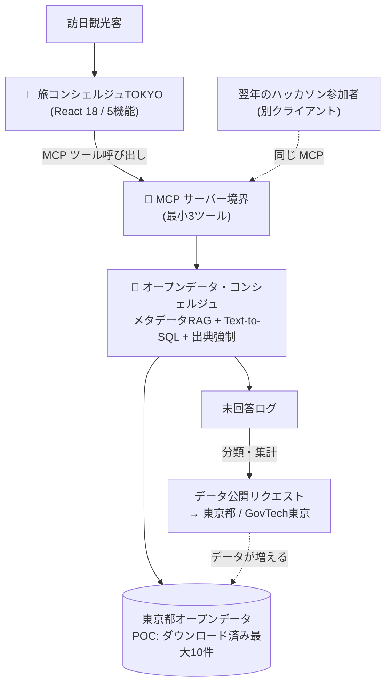
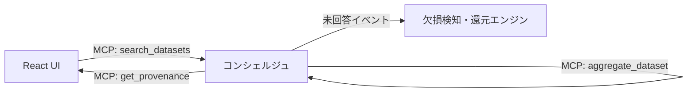

# ARCHITECTURE.md - システムアーキテクチャ設計書

## 1. アーキテクチャ概要

### システム概要

旅コンシェルジュTOKYO は、訪日観光客向けの AI 旅行ガイドアプリ（フロントエンド）と、東京都オープンデータカタログ約9,600データセットから答えを組み立てる「オープンデータ・コンシェルジュ」（バックエンド）の2層で構成される。両者は **MCP（Model Context Protocol）** で接続する。

この分離が本システムの中心設計であり、「旅行アプリはコンシェルジュの最初のクライアントにすぎない」という思想を構造で表現している。翌年のハッカソン参加者は同じ MCP サーバーに別のクライアントを接続できる。

### アーキテクチャスタイル

- **採用パターン**: サーバーレス（Cloudflare）＋ MCP サーバーによるツール公開
- **設計原則**: 出典強制（Provenance by Design）— 根拠データセットを提示できない回答は生成しない。CC BY 4.0 の表示義務をアーキテクチャで自動的に満たす
- **通信方式**: フロントエンド ⇄ バックエンドは MCP（ツール呼び出し）。カタログデータは POC 段階ではダウンロードして同梱する

## 2. システム構成図

### 全体アーキテクチャ



### レイヤー構成

```
┌─────────────────────────────────────┐
│ Presentation Layer                  │  React UI（プロフィール/プラン/スキャン/周辺/あなたへ）
├─────────────────────────────────────┤
│ Protocol Layer (MCP)                │  データセット検索・集計・出典取得
├─────────────────────────────────────┤
│ Application Layer                   │  旅程生成・マナー案内・スポット推薦・欠損検知
├─────────────────────────────────────┤
│ Domain Layer                        │  出典強制ルール・データ公開リクエスト生成
├─────────────────────────────────────┤
│ Infrastructure Layer                │  オープンデータ（同梱）/ Cloudflare 実行環境
└─────────────────────────────────────┘
```

## 3. コンポーネント設計

### 主要コンポーネント

| コンポーネント名 | 責務 | 技術スタック | インターフェース |
| ---------------- | ---- | ------------ | ---------------- |
| 旅コンシェルジュTOKYO（FE） | 5機能の UI 提供、旅行者プロフィールの収集、出典リンクの表示 | React 18 ＋ dc-runtime | MCP クライアント |
| MCP サーバー境界 | コンシェルジュ機能をツールとして公開する | MCP | データセット検索 / 集計 / 出典取得（[API.md](./API.md) 参照） |
| メタデータRAG | 約9,600件のメタデータから質問に合うデータセットを特定する | OpenCode ＋ Cloudflare Workers AI | 内部呼び出し |
| Text-to-SQL | 特定したデータセットに対しその場で集計する | 同上 | 内部呼び出し |
| 出典強制モジュール | 出典リンクと実行クエリを構造的に付与し、根拠がなければ回答を止める | 同上 | 全回答の通過点 |
| 欠損検知・還元エンジン | 未回答を分類し、データ公開リクエストに変換する | 同上 | レポート出力（四半期） |

### コンポーネント間通信

> ツール名は仮称（SSOT: [API.md](./API.md) §3）。



## 4. データアーキテクチャ

### データストア設計

| データストア | 種類 | 用途 | 選定理由 |
| ------------ | ---- | ---- | -------- |
| 同梱オープンデータ（最大10件） | 静的ファイル（CSV / GIS） | POC のデータ源 | 2日間のスコープでフル動的取り込みを行わない判断（2026-08-15 合意） |
| データベース | 未使用 | - | POC では永続化要件がないため。詳細は [DATABASE.md](./DATABASE.md) |

### データフロー

```
質問 → メタデータRAG（どのデータセットか特定）
     → Text-to-SQL（その場で集計）
     → 出典強制（データセットリンク＋クエリを付与）
     → 回答（出典付き）
     ↘ 答えられなかった場合 → 未回答ログ → 分類 → データ公開リクエスト（都へ）
```

### データ同期戦略

- **同期方式**: POC では同期なし（ダウンロード時点のスナップショットを同梱）
- **整合性モデル**: スナップショット整合（更新頻度の高いデータは提出直前に最新版へ差し替える）
- **レプリケーション**: 該当なし

## 5. インフラストラクチャ

### デプロイメント構成

```yaml
環境:
  開発:
    - 構成: ローカル実行（React バンドル＋JSX事前変換によりオフライン動作を確認済み）
  ステージング:
    - 構成: 未定（本フェーズでは設けない）
  本番:
    - 構成: Cloudflare（主催者提供スタック）。First Stage はライブデモ不可のため常時公開は必須要件ではない
```

### スケーリング戦略

- **水平スケーリング**: Cloudflare のマネージド実行環境に委ねる
- **垂直スケーリング**: 該当なし
- **自動スケーリング**: 該当なし（本フェーズでは負荷要件を設定しない）

## 6. セキュリティアーキテクチャ

### セキュリティレイヤー

1. **ネットワークセキュリティ**
   - Cloudflare のマネージド境界に依存する
   - 未定: 公開範囲（限定公開 / 一般公開）の判断は提出フォームの「公開可否」設定と合わせて決める

2. **アプリケーションセキュリティ**
   - 出典強制モジュールを全回答の通過点とし、根拠のない生成（ハルシネーション）を構造的に遮断する
   - 未定: 入力値の取り扱い方針は POC 実装時に決定

3. **データセキュリティ**
   - 取り扱うのは公開済みオープンデータのみ。個人を特定する情報は保持しない
   - 旅行者プロフィール（同行者・興味・ペース）は個人を特定しない粒度に留める

### 認証・認可

- **認証方式**: 未定（POC では利用者認証を伴う機能を実装しない方針）
- **認可モデル**: 未定
- **セッション管理**: 未定

## 7. 非機能要件の実現

### パフォーマンス

- **目標レスポンスタイム**: 未定（POC 実装時に実測して設定）
- **最適化戦略**: 未定
- **キャッシング**: 未定（POC はデータ同梱のため実行時取得が発生しない）

### 可用性

- **目標SLA**: 未定（SLA 契約は存在しない）
- **冗長化**: Cloudflare のマネージド構成に委ねる
- **障害復旧**: 該当なし（本フェーズでは対象外）

### 監視・ログ

- **監視ツール**: 未定
- **メトリクス**: 回答成功率・未回答率（[PROJECT.md](../01-context/PROJECT.md) §8 の KPI に対応）
- **ログ集約**: 未回答ログはデータ公開リクエスト生成の入力として扱う（機能要件であり運用監視とは別系統）

## 8. 技術スタック

> **重要**: AIには学習データのカットオフがあるため、バージョンを明記することで正しい書き方を指示できます。

### 技術選定一覧

| レイヤー | 技術 | バージョン | 選定理由 | ADR |
| -------- | ---- | ---------- | -------- | --- |
| Frontend | React | 18.x | UI が実装済み（2026-08-15 動作確認）。追加学習コストなしで実データ化に集中できる | ADR-003 |
| Frontend Runtime | dc-runtime | 未確認（実装時に確定） | 既存 UI 資産がこの構成で動作しているため | - |
| Frontend Build | JSX 事前変換 ＋ ローカル React バンドル | - | CDN（unpkg）依存を外し、オフラインでも動作させるため | - |
| Protocol | MCP（Model Context Protocol） | 未確認（実装時に確定） | バックエンドを「旅行アプリ専用API」ではなく再利用可能な基盤として公開するため | ADR-003 |
| Backend Stack | OpenCode | 未確認（主催者提供スタック） | 主催者公認スタックで完成度と実現性を担保するため | ADR-002 |
| Cloud / Runtime | Cloudflare（Workers AI 含む） | マネージド | 同上 | ADR-002 |
| Database | 使用しない | - | POC ではダウンロード済みデータを同梱するため | ADR-004 |
| CI/CD | 未定 | - | 提出期限までのスコープに含めない | - |

> バージョンが「未確認」の項目は、POC 実装に着手した時点で実際に利用するバージョンを確認して更新すること（推測で埋めない）。

### バージョン管理方針

- **メジャーバージョン**: ADR作成必須
- **マイナーバージョン**: 互換性確認後に更新
- **パッチバージョン**: セキュリティ修正時に即時適用

### 詳細

#### フロントエンド

- **フレームワーク**: React 18.x（日本語版・英語版の2バージョンが実装済み）
- **状態管理**: 未確認（既存 UI 実装に準ずる）
- **UIライブラリ**: 未確認（既存 UI 実装に準ずる）
- **モックデータ**: 渋谷（ナイトライフ）・上野（浅草・家族）のシナリオが SCENARIOS として実装済み。これをオープンデータ由来の内容へ差し替えることで代表エリアの画面イメージを作成できる

#### バックエンド

- **言語**: 未確認（OpenCode ＋ Cloudflare 構成に準ずる）
- **フレームワーク**: OpenCode ＋ Cloudflare Workers AI
- **APIゲートウェイ**: MCP サーバーが外部インターフェースを兼ねる

#### インフラ

- **クラウド**: Cloudflare
- **コンテナ**: 使用しない（サーバーレス）
- **CI/CD**: 未定

## 9. 設計判断記録（ADR）

> ADR（Architecture Decision Record）は、技術選定や設計判断の理由を記録するものです。
> AIが技術選定の背景を理解し、一貫した設計提案ができるようになります。

### ADR一覧

決定の全文と背景は [DECISIONS.md](../06-reference/DECISIONS.md) に記録する。

| ADR | タイトル | ステータス | 決定日 |
| --- | -------- | ---------- | ------ |
| ADR-001 | オープンデータ・コンシェルジュ1案への絞り込み | 承認済み | 2026-08-07 |
| ADR-002 | バックエンドを主催者提供スタック（OpenCode ＋ Cloudflare）で完結させる | 承認済み | 2026-08-07 |
| ADR-003 | フロント＝旅行アプリ／バック＝コンシェルジュを MCP で接続する構成 | 承認済み | 2026-08-15 |
| ADR-004 | 当日スコープを POC レベル（データ同梱・代表エリア限定）に確定 | 承認済み | 2026-08-15 |
| ADR-005 | 出典強制を機能要件かつライセンス遵守手段として設計に組み込む | 承認済み | 2026-08-15 |

### ADRテンプレート

```markdown
## ADR-00X: [技術名]の選定

### ステータス

承認済み / 検討中 / 廃止

### コンテキスト

[なぜこの決定が必要になったのか]

### 決定

[何を選んだのか、バージョンを含めて明記]

### バージョン選定理由

- **なぜこのバージョンか**: [具体的な理由]
- **AIカットオフ対策**: [このバージョンはAIの知識範囲内か、注意点は何か]
- **非推奨API回避**: [避けるべき古いAPIパターン]
- **LTS/サポート期間**: [サポート終了予定]

### 代替技術との比較

| 技術    | 採用/却下 | 理由   |
| ------- | --------- | ------ |
| [代替1] | 却下      | [理由] |
| [代替2] | 却下      | [理由] |

### 影響

- **ポジティブ**: [良い影響]
- **ネガティブ**: [考慮すべき制約]

### AIへの指示

[この技術を使う際に、AIが守るべきルール]

### 関連

- 関連ADR: ADR-00Y
- 公式ドキュメント: [URL]
```

## 10. 開発ガイドライン

### コーディング規約

- [CONVENTIONS.md](../03-implementation/CONVENTIONS.md)
- [PATTERNS.md](../03-implementation/PATTERNS.md)

### API設計原則

- MCP ツールは「検索・集計・出典取得」の最小3つから始め、必要が実証されたものだけ追加する
- すべての回答経路は出典強制モジュールを通す。出典を返せないツール応答は不正とみなす
- 答えられないことは失敗ではない。未回答は「データ公開リクエスト」という別の出力に変換する（silent failure を作らない）

### テスト戦略

- **単体テスト**: 未定（[TESTING.md](../04-quality/TESTING.md) にて POC 実装時に確定）
- **統合テスト**: MCP ツール呼び出しの疎通確認を最優先とする
- **E2Eテスト**: 代表シナリオ（渋谷ナイトライフ・上野ファミリー）の縦貫通を手動で確認する

## 11. 将来の拡張性

### 拡張ポイント

- MCP サーバーへの別クライアント接続（翌年のハッカソン参加者への基盤開放）
- カタログ外データへの拡張（都議会会議録の要約接続。公式 API 化の提案を含む）
- 介助者モード・音声対応（Final Stage）
- やさしい日本語対応

### 技術的負債の管理

- POC で同梱したデータは実行時取得へ置き換える前提の暫定措置であり、Final Stage までに動的取り込みの可否を判断する
- バージョン「未確認」の技術は実装着手時に確定させ、本書を更新する

### ロードマップ

Phase 番号は [ROADMAP.md](../07-project-management/ROADMAP.md) に準拠する（独自採番はしない）。

| フェーズ | 時期 | 追加機能/改善 |
| -------- | ---- | ------------- |
| Phase 2（POC 実装・提出準備） | 〜2026-08-23 | POC 実装・代表エリア画面・MCP 最小3ツール |
| Phase 3（First Stage 収録） | 2026-08-26〜30 | 2分プレゼン収録（ライブデモ不可） |
| Phase 4（Final Stage 準備） | 〜2026-10-17 | 介助者モード・音声対応、都への API 公開提案、動的取り込みの検討 |

## Changelog

### [1.0.0] - 2026-08-15

#### 追加

- 初版作成
